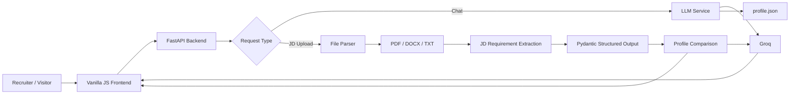

# Prajwal AI

> An AI-powered portfolio assistant built to help recruiters, hiring managers, interviewers, and visitors explore Prajwal's technical profile through a conversational interface.

Prajwal AI turns a traditional portfolio into an interactive experience. Instead of navigating through static pages, a visitor can ask questions about Prajwal's **education, internships, projects, technologies, achievements, DSA journey, current focus, and future learning** and receive grounded answers from an LLM-backed assistant.

It also includes a **Job Description Analyzer** that accepts a PDF, DOCX, or TXT job description, extracts its requirements, and compares them against Prajwal's documented profile.

---

## ✨ What makes it different?

A normal portfolio tells you what a developer has built.

**Prajwal AI lets you ask.**

For example:

- `Tell me about Prajwal's AI engineering experience.`
- `Which projects use MongoDB?`
- `What did he build during his Generative AI internship?`
- `Which technologies has he used with microservices?`
- `Analyze this Backend Developer job description.`

The assistant is intentionally **grounded rather than promotional**. Its source of truth is `backend/data/profile.json`, and the prompting layer is designed to distinguish between:

- Professional / internship experience
- Project experience
- Current learning
- Future learning

That distinction is important for a recruiter-facing portfolio because a technology appearing somewhere in a project should not automatically become a claim of professional expertise.

---

## 🚀 Features

### AI Portfolio Chat

- Conversational AI assistant powered by Groq
- Grounded responses using `profile.json`
- Multi-turn conversation history
- Follow-up question support
- Streaming responses for a more natural chat experience
- Markdown links for GitHub, live demos, LinkedIn, email, and phone numbers when documented
- Concise, recruiter-friendly responses

### 📄 Job Description Analyzer

Upload a:

- PDF
- DOCX
- TXT

The pipeline:

1. Validates the uploaded file
2. Extracts readable text
3. Detects whether the document is actually a job description
4. Extracts structured requirements using an LLM
5. Compares those requirements against Prajwal's profile
6. Returns structured findings such as:
   - Overall alignment
   - Strong matches
   - Partial matches
   - Gaps
   - Relevant projects
   - Relevant professional experience

### 🔐 Accuracy & Security

- Strict source-of-truth profile
- Prompt-injection protections for uploaded documents and recruiter text
- Pydantic validation for structured LLM responses
- Strict JSON schema output for JD extraction and comparison
- Request size limits
- Recruiter message limits
- File type and content-signature validation
- In-memory rate limiting for V1
- LLM timeouts
- Safe client-facing error messages
- `AbortController` based request cancellation
- Frontend request timeouts to avoid stuck loading states

### 🎨 UI / UX

- ChatGPT / Claude-inspired interface
- Vanilla HTML, CSS, and JavaScript frontend
- Dark and light themes
- Responsive layout
- New Chat control
- File attachment preview
- Animated thinking state
- Streaming assistant output
- Server wake-up experience for backend cold starts
- Reduced-motion support
- Custom tooltips and Lucide icons

---

## 🏗️ Architecture



### Request flow — normal chat

```text
User message
    ↓
Frontend validation
    ↓
POST /api/chat/stream
    ↓
FastAPI rate limiter
    ↓
Chat service
    ↓
Grounded system prompt + profile + recent history
    ↓
Groq streaming response
    ↓
Frontend renders chunks in real time
```

### Request flow — job description analysis

```text
PDF / DOCX / TXT
    ↓
File validation
    ↓
Text extraction
    ↓
JD detection + requirement extraction
    ↓
Strict JSON schema
    ↓
Pydantic validation
    ↓
Compare against profile.json
    ↓
Structured JD analysis
    ↓
Recruiter-friendly chat response
```

---

## 🧠 AI Design

The AI layer is deliberately designed around **grounded generation** rather than generic chatbot behavior.

### Source of truth

`backend/data/profile.json` is the authoritative source for factual claims about Prajwal.

The assistant is instructed not to invent:

- Companies
- Internships
- Responsibilities
- Technologies
- Certifications
- Achievements
- Project features
- Professional expertise
- URLs
- Metrics

### Professional vs project experience

The system explicitly separates professional experience from personal/project experience.

For example, if a technology appears in a portfolio project, the assistant should explain where it was used instead of automatically presenting it as professional work experience.

### Structured outputs

The JD analysis pipeline uses Pydantic models to define the expected output shape and strict JSON-schema responses from the LLM.

This makes the AI output predictable enough to use inside an application instead of treating raw model text as trusted application data.

---

## 🧰 Tech Stack

| Layer | Technology |
|---|---|
| Frontend | HTML5, CSS3, Vanilla JavaScript |
| UI / Animation | Motion, Lucide Icons |
| Backend | Python, FastAPI |
| Validation | Pydantic |
| LLM | Groq — `openai/gpt-oss-120b` |
| LLM SDK | `groq` |
| File Uploads | `python-multipart` |
| PDF Parsing | `pypdf` |
| DOCX Parsing | `python-docx` |
| Configuration | `python-dotenv` |
| Environment Management | `uv` + Python 3.14 |
| Deployment | Static frontend + Render-hosted backend |

---

## 📁 Project Structure

```text
prajwal-ai/
│
├── backend/
│   ├── data/
│   │   └── profile.json
│   │
│   ├── models/
│   │   ├── chat.py
│   │   └── jd.py
│   │
│   ├── parsers/
│   │   ├── pdf_parser.py
│   │   ├── docx_parser.py
│   │   └── txt_parser.py
│   │
│   ├── routers/
│   │   ├── chat.py
│   │   └── jd.py
│   │
│   ├── services/
│   │   ├── llm_service.py
│   │   ├── jd_service.py
│   │   └── rate_limiter.py
│   │
│   └── main.py
│
├── frontend/
│   ├── index.html
│   ├── style.css
│   └── app.js
│
├── .gitignore
├── pyproject.toml
└── README.md
```

> The exact file naming can evolve as the project grows; the structure above reflects the V1 separation of frontend, API routing, parsing, business logic, and data.

---

## ⚙️ Local Development

### 1. Clone the repository

```bash
git clone https://github.com/Prajwal-dev-dsa/PrajwalAI
cd PrajwalAI
```

### 2. Create the project environment

This project uses `uv` rather than `pip`.

```bash
uv python pin 3.14
uv venv --python 3.14
```

### 3. Install dependencies

```bash
uv sync
```

If you are setting the project up from scratch, the V1 dependencies are based around:

```text
fastapi[standard]
groq
python-dotenv
python-multipart
pypdf
python-docx
```

### 4. Add environment variables

Create a local `.env` file in the project root:

```env
GROQ_API_KEY=your_groq_api_key
GROQ_MODEL=openai/gpt-oss-120b
```

Do **not** commit `.env` or API keys to GitHub.

### 5. Start the backend

From the project root:

```bash
uv run uvicorn backend.main:app --reload
```

The API will run locally on:

```text
http://127.0.0.1:8000
```

### 6. Run the frontend

Serve the `frontend/` directory through a local static server. For example:

```bash
cd frontend
python -m http.server 5500
```

Then open:

```text
http://127.0.0.1:5500
```

---

## 🔌 API Endpoints

### Health

```http
GET /api/health
```

Used by the frontend to determine whether the backend is ready.

### Normal chat

```http
POST /api/chat
```

Returns a complete AI response.

### Streaming chat

```http
POST /api/chat/stream
```

Streams the assistant response chunk-by-chunk using a plain-text response stream.

### Parse uploaded document

```http
POST /api/jd/parse
```

Extracts text from a supported PDF, DOCX, or TXT file.

### Analyze job description

```http
POST /api/jd/analyze
```

Runs the complete JD pipeline: parsing → requirement extraction → profile comparison.

---

## 📄 JD Analysis Output

The structured comparison model contains:

```json
{
  "overall_alignment": "strong | moderate | limited",
  "summary": "...",
  "strong_matches": [],
  "partial_matches": [],
  "gaps": [],
  "relevant_projects": [],
  "relevant_experience": []
}
```

The system intentionally avoids fabricating a numeric match percentage. The goal is to show **documented evidence and gaps**, not manufacture a precision score that the underlying data cannot justify.

---

## 🛡️ V1 Hardening

The V1 implementation includes several defensive checks:

- Maximum uploaded file size: **10 MB**
- Accepted file extensions: **`.pdf`, `.docx`, `.txt`**
- Basic file-signature checks for PDF and DOCX
- Maximum chat input length: **4000 characters**
- Maximum recruiter/JD instruction length: **2000 characters**
- Maximum JD analysis text: **16,000 characters**
- Chat rate limiting: **20 requests per client bucket**
- JD parse rate limiting: **20 requests per client bucket**
- JD analysis rate limiting: **10 requests per client bucket**
- LLM timeouts for structured JD operations
- Client-side request cancellation and timeouts
- Safe error messages that do not expose internal exception details

The V1 rate limiter is intentionally **in-memory**, which keeps the architecture simple but means rate-limit state is local to a running backend instance and resets when the process restarts.

---

## 🌐 Deployment

The frontend is a static application and the backend is deployed separately.

Because the backend can spin down after periods of inactivity on the hosting tier, the frontend includes a **server wake-up experience** that:

1. Checks `/api/health`
2. Detects when the backend is unavailable or waking up
3. Shows a branded loading state instead of failing silently
4. Polls until the backend becomes available
5. Automatically dismisses the wake-up screen once the API is healthy

This makes cold-start behavior explicit instead of making a recruiter wonder whether the portfolio is broken.

---

## 🎯 Design Goals

Prajwal AI was built around a few simple principles:

**1. Grounded over exaggerated**  
The assistant should represent the profile accurately, even when the answer is less impressive.

**2. Real application patterns**  
Streaming, structured outputs, validation, file parsing, request cancellation, rate limiting, timeouts, and prompt-injection handling are implemented as actual application concerns rather than demo-only features.

**3. Simple architecture**  
The V1 intentionally avoids unnecessary complexity. The frontend is vanilla JavaScript and the backend is FastAPI with a small service layer.

**4. Recruiter-first UX**  
A visitor should be able to understand the candidate quickly without learning how the application works.

**5. Verifiable information**  
Where the profile contains project, GitHub, deployment, or professional links, the assistant can surface those exact documented links.

---

## 🔮 Future Scope

Possible future iterations can build on the current V1 foundation with features such as:

- Persistent conversations
- Authentication and recruiter sessions
- Database-backed rate limiting
- Analytics for portfolio questions
- Better document observability and parsing diagnostics
- Retrieval / RAG for a larger knowledge base
- Voice-based portfolio interaction
- Richer recruiter workflows around multiple job descriptions
- Background jobs for heavier document processing

These are intentionally outside the current V1 scope.

---

## 👨‍💻 About Prajwal

**Prajwal** is a final-year B.Tech Computer Science and Engineering student focused on **software development and AI engineering**.

His documented profile includes hands-on work across:

- Full-stack web development
- Node.js and Express.js backend systems
- React and Next.js applications
- PostgreSQL and MongoDB
- Microservices architecture
- Generative AI and LLM applications
- LangChain / LangGraph
- RAG and vector search
- Real-time systems
- Authentication, payments, and API design
- Data Structures & Algorithms in C++

The portfolio assistant uses the project profile as its factual source of truth so that visitors can explore these areas interactively.

---

## 📫 Connect

- **GitHub:** https://github.com/Prajwal-dev-dsa
- **LinkedIn:** https://www.linkedin.com/in/prajwaldwivedi
- **LeetCode:** https://leetcode.com/Prajwald01
- **Email:** prajwal77dwivedi@gmail.com

---

## 📜 License

This project is a personal portfolio application. Unless a separate license is added to the repository, the source should be treated as personal project code rather than open-source software with unrestricted reuse rights.

---

<p align="center">
  Built with FastAPI, Groq, vanilla JavaScript, and a lot of engineering curiosity.
</p>
